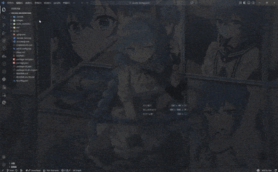
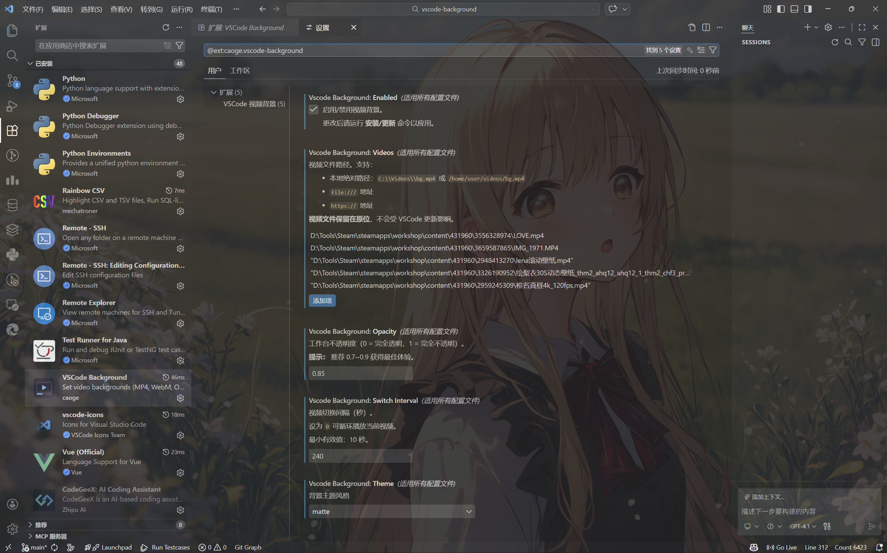
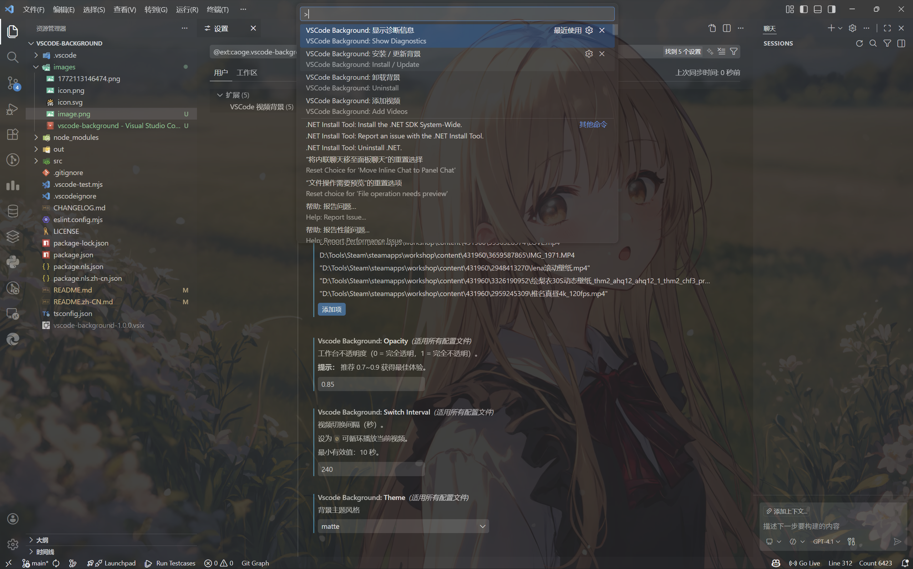
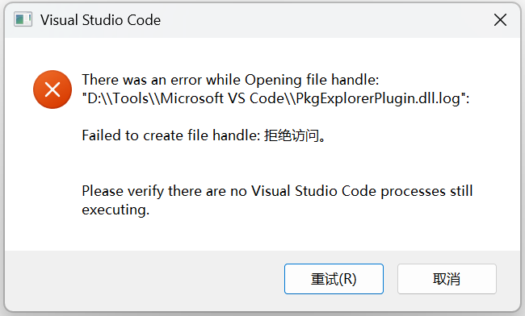
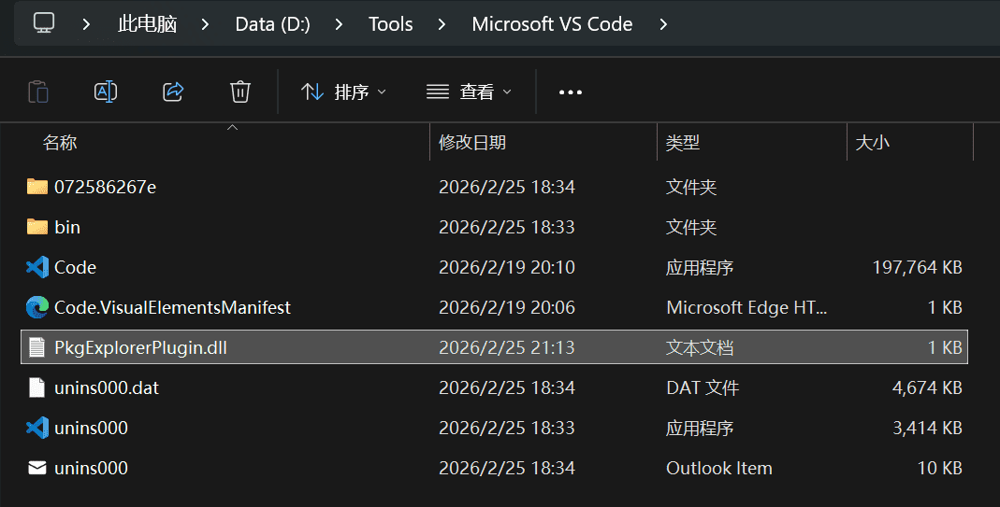

# VSCode Background

A Visual Studio Code extension that sets video backgrounds (MP4, WebM, OGG) in your workspace **without deleting them on VSCode updates**.

English | [简体中文](./README.zh-CN.md)

---

## 🔗 Resources

- **[GitHub Discussions](https://github.com/caoge5524/vscode-background/discussions)** — Share and discover community backgrounds
- **[Workshop Guide](./WORKSHOP.md)** — Complete guide to sharing backgrounds
- **[Issues & Bugs](https://github.com/caoge5524/vscode-background/issues)** — Report problems
- **[Changelog](./CHANGELOG.md)** — Version history and updates

---

## Features

- **Video Background Support**: MP4, WebM, or OGG videos as your VSCode background
- **🆕 Image Background Support**: JPG, PNG, GIF (animated), WebP, BMP, SVG as backgrounds
- **🆕 Per-Slot Transition Effects**: Choose from 10 transition types (zoom, fade, slide-left, slide-right, wipe-up, wipe-down, spiral, flip, blur, instant) for each slot — transitions are slot-bound including wrap-around from last back to first
- **🆕 ⏩ Instant Jump**: Click the ⏩ button on any file row in "Manage Media" to instantly switch the running background — no restart needed
- **Mixed Media Slideshow**: Videos and images can be freely mixed in the same playlist
- **Multiple Media**: Load multiple videos/images with automatic rotation at configurable intervals
- **Settings.json Editable**: All configuration directly in `settings.json`, survives VSCode updates
- **Persistent Media**: File paths stored in settings, files remain in original locations (not copied)
- **Auto-Recovery After Updates**: Detects missing patches after VSCode updates and prompts to reapply
- **Auto-Cleanup on Uninstall**: `vscode:uninstall` hook automatically removes patch when extension is uninstalled
- **Infinite Loop Mode**: Set `switchInterval` to 0 to loop a single media forever
- **Multiple Themes**: Glass, Matte, Neon, Cinema, Aurora, Minimal, Retro themes
- **Customizable Settings**: Opacity, switch interval, theme selection
- **First-Run Welcome**: Automatically guides new users to configure media paths on first install
- **Background Workshop**: Community sharing via [GitHub Discussions](https://github.com/caoge5524/vscode-background/discussions) / [Workshop Guide](./WORKSHOP.md)

## Demo

>

---

## What's New in v2.3.0

**Jump Button + Path Fixes**:
- ✅ **⏩ Instant jump** — each file row in "Manage Media" now has a ⏩ button; clicking it immediately switches the live background to that media via a lightweight `vscbg-jump.json` IPC file polled every 500 ms by the injected JS (requires reinstalling the patch with v2.3.0+)
- ✅ **Chinese / Unicode path fix** — removed the unnecessary non-ASCII guard in `Add Media`; all Unicode file paths are now accepted by the file picker
- ✅ **Playback order preserved** — jumping to a media only changes the current display; restarting VSCode automatically restores the original configured playback order, unaffected by the jump

> ⚠️ The ⏩ jump button requires the background patch to be (re-)installed with v2.3.0+. Run **`Install / Update`** once to activate polling.

---

## What's New in v2.2.0

**10-Type Per-Slot Transition System**:
- ✅ **10 transition types** — `zoom` (scale+fade), `fade` (crossfade), `slide-left`, `slide-right`, `wipe-up` (enter from bottom), `wipe-down` (enter from top), `spiral` (rotate+scale spring), `flip` (3D rotateY), `blur` (blur-fade), `instant`
- ✅ **Wrap-around transition** — `transitions[n-1]` covers the last→first loop; array length is now `videos.length`
- ✅ **Slot-bound** — transitions stay at their index when you drag files
- ✅ **Visual editor redesigned** — `Manage Media` shows a ↕ row between each file pair **plus** a ↩ wrap-around row at the bottom
- ✅ **Filter support** — `blur` effect and all effects now animate CSS `filter` in addition to `opacity`/`transform`

> 💡 **Transition tip**: `spiral`/`flip` for drama; `slide-left`/`slide-right` for slideshow; `fade`/`zoom` for ambient; `instant` for a sharp cut.

---

## What's New in v2.1.0

**Image Background Support + UX Enhancements**:
- ✅ **Image backgrounds** — JPG, PNG, animated GIF, WebP now fully supported as backgrounds
- ✅ **Mixed media slideshow** — freely mix videos and images in `vscodeBackground.videos`; smooth fade transitions between each item
- ✅ **Cross-platform path support** — removed the English-only path restriction; Chinese, Japanese, and all Unicode paths now work on Windows, macOS, and Linux
- ✅ **First-Run Welcome Popup** — on first install, automatically guides you to configure media paths
- ✅ **Open File Explorer Button** — quick link to browse files and copy paths to settings
- ✅ **Background Workshop** — [WORKSHOP.md](./WORKSHOP.md) created as community guide; share and discover backgrounds via GitHub Discussions

> 💡 **Image tip**: Add `"C:\\Photos\\bg.jpg"` (or `"/home/user/bg.png"`) to `vscodeBackground.videos` just like a video path.

---

## What's New in v2.0.0

**Major Architecture Rewrite**:
- ✅ Videos **no longer deleted on VSCode updates** (main v1 complaint fixed)
- ✅ **Single-file patching approach** (modifies only `workbench.desktop.main.js`)
- ✅ **Video paths in settings.json** (no more copying to temporary folders)
- ✅ **Simplified commands** (4 commands vs 16 in v1)
- ✅ **Auto-recovery** (detects missing patches after updates)
- ✅ **Auto-cleanup** (uninstall hook handles cleanup automatically)
- ✅ **Modular code** (6 focused modules vs 1935-line monolith)

See [CHANGELOG.md](./CHANGELOG.md) for complete upgrade details and migration guide.

## Installation

### First Time Setup

1. **Install** the extension from VSCode Marketplace
2. **Open Settings** (`Ctrl+,`) → Search `VSCode Background`
3. **Check the settings** (should be empty initially)
4. **Add videos** by running command: `VSCode Background: Add Videos`
5. **Apply** by running command: `VSCode Background: Install / Update`
6. **Accept** the Administrator permission prompt (UAC)
7. **Restart** VSCode

### Quick Start (Settings.json Method)

1. **Open Settings UI** (`Ctrl+,`) → Search "VSCode Background"
2. **Find the settings** (all 5 sections)
3. **Edit directly** or use commands to set values
4. **Run command** `Install / Update` to apply changes
5. **Restart** VSCode

## Usage

### Recommended: Direct Settings.json Editing


Open Settings (`Ctrl+,`) and search "VSCode Background":

#### Settings UI Example


#### Command Line Example


```json
{
  "vscodeBackground.enabled": true,
  "vscodeBackground.videos": [
    "C:\\Videos\\background1.mp4",
    "C:\\Videos\\background2.mp4",
    "https://example.com/video.mp4"
  ],
  "vscodeBackground.opacity": 0.8,
  "vscodeBackground.switchInterval": 180,
  "vscodeBackground.theme": "glass"
}
```


### Managing Video/Image Order and Transitions

You can visually manage the order and per-slot transitions via the command:

- **`VSCode Background: Manage Media`**

This opens a drag-and-drop UI showing:
- **File rows** — drag to reorder; click ⏩ to instantly jump to that background; click 🗑️ to delete
- **Transition rows** (↕) between each pair of files — pick one of 10 effects from the dropdown
- **Wrap-around row** (↩) after the last file — controls the last→first transition when the playlist loops

**Important**: transition effects are **slot-bound** — they stay at their index even when you drag files around.

Save → run **`VSCode Background: Install / Update`** → restart VSCode.


### Via Commands

Press `Ctrl+Shift+P` to open Command Palette:

- **`Install / Update`** - Apply current settings from settings.json (core command)
- **`Uninstall`** - Remove background from workbench (cleanup command)
- **`Add Media (Videos / Images)`** - Open file picker to add video/image paths to settings.json
- **`Manage Media`** - Visually manage, sort, add, or delete videos/images
- **`Show Diagnostics`** - Display debug information
- **`Open Background Workshop`** - Open community sharing page

## Extension Settings

| Setting                           | Type    | Default | Description                                                                                                                                                            |
| --------------------------------- | ------- | ------- | ---------------------------------------------------------------------------------------------------------------------------------------------------------------------- |
| `vscodeBackground.enabled`        | boolean | false   | Enable/disable background                                                                                                                                              |
| `vscodeBackground.videos`         | array   | []      | **Media file paths** (videos, images, or URLs)                                                                                                                         |
| `vscodeBackground.transitions`    | array   | []      | **Per-slot transition** (10 types: `zoom`, `fade`, `slide-left`, `slide-right`, `wipe-up`, `wipe-down`, `spiral`, `flip`, `blur`, `instant`; length = `videos.length`) |
| `vscodeBackground.opacity`        | number  | 0.8     | Background opacity (0-1)                                                                                                                                               |
| `vscodeBackground.switchInterval` | number  | 180     | Switch interval in **seconds** (0 = infinite loop)                                                                                                                     |
| `vscodeBackground.theme`          | string  | "glass" | Theme: "glass", "matte", "neon", "cinema", etc.                                                                                                                        |

### Video Path Formats

All formats are supported and automatically converted:

```json
"vscodeBackground.videos": [
  "C:\\Users\\You\\Videos\\bg.mp4",          // Windows video
  "/home/user/photos/bg.jpg",                // Linux/Mac image
  "C:\\用户\\图片\\背景.png",                   // Unicode paths fully supported
  "file:///C:/Videos/video.mp4",             // file:// URL
  "https://example.com/background.mp4",      // HTTPS URL
  "data:video/mp4;base64,..."                // Base64-encoded video
]
```

**Supported formats**:
- **Video**: MP4, WebM, OGG
- **Image**: JPG/JPEG, PNG, GIF (animated), WebP, BMP, SVG
- Videos and images can be **freely mixed** — they will fade-transition between each other

**Important**: Files are **NOT copied anywhere**. Paths point to original locations.

## Commands

| Command            | Purpose                                                              |
| ------------------ | -------------------------------------------------------------------- |
| `Install / Update` | **Core** - Apply background with current settings from settings.json |
| `Uninstall`        | **Cleanup** - Completely remove background from VSCode               |
| `Add Videos`       | **Helper** - Open file picker to add video paths to settings.json    |
| `Show Diagnostics` | **Debug** - Display extension and system information                 |

## Why v2.0.0 is Better

### Problem in v1
- Videos stored in `background-videos/` folder inside VSCode installation
- Folder deleted on every VSCode update (maintenance, minor, major)
- Users had to re-add videos repeatedly
- Very frustrating user experience ❌

### Solution in v2
- Video **paths** stored in `settings.json` (survives updates)
- Actual files stay in user's original location (untouched by VSCode)
- Patch detects missing files and prompts user to reapply
- No file copying, no folder management ✅

```
v1 Flow: Select Video → Copy to background-videos/ → VSCode Update → Deleted ❌
v2 Flow: Select Video → Store Path in settings.json → VSCode Update → Path Still There ✅
```

## Important Notes

### ⚠️ Before Uninstalling

**Just run the uninstall command** - the cleanup hook automatically handles it:

1. Open Command Palette
2. Run: `VSCode Background: Uninstall`
3. Then uninstall the extension

The `vscode:uninstall` hook will automatically remove the patch from `workbench.desktop.main.js`.

### If Using v1 Before

v2 automatically:
- ✅ Reads your old v1 settings
- ✅ Migrates video paths to new format
- ✅ Cleans up old patch files
- ✅ Prompts to apply new background

**No data loss!**

### "Installation appears corrupt" Warning

VSCode shows this because we modified its files. Harmless - can dismiss or ignore.

To hide the warning automatically, the extension injects CSS that hides the notification.

### Administrator Permission

First time applying settings requires **Administrator privilege**:

✅ Normal and expected (modifying VSCode core system files)
✅ Click "Yes" on UAC prompt
❌ If denied, background won't apply

Script location: Temporary PowerShell script in extension directory
Scope: Only modifies VSCode's `workbench.desktop.main.js` file

### File Locked Error

If you see: **"File is locked" or "Access Denied"**

**Root cause**: VSCode is currently using the workbench files

**Solution**:
1. Close all VSCode windows completely
2. Right-click VSCode → "Run as Administrator"
3. Open your workspace in admin VSCode
4. Run `Install / Update` command again
3
## File Locked / Access Denied Error Popup



As shown above, if you see a popup error like "Access Denied" or "Failed to create file handle", it means some VSCode processes are still running and locking files.

**This error does NOT harm your files or system**

- Solution:
  1. Close all VSCode windows
  2. Delete the PkgExplorerPlugin.dll file
  >

---

## Supported Media Formats

### Videos

- **MP4** (H.264/H.265)
- **WebM** (VP8/VP9)
- **OGG** (Theora)
- **HTTPS URLs** (streamed, not downloaded)

### Images

- **JPG / JPEG**
- **PNG**
- **GIF** (animated GIFs supported)
- **WebP**
- **BMP**
- **SVG**

Videos and images can be **freely mixed** in `vscodeBackground.videos` for a blended slideshow.

## Requirements

- VSCode 1.108.1 or higher
- Windows/Mac/Linux
- Administrator privileges (first-time setup only)

## Troubleshooting

### Background not showing after apply

1. Make sure to **restart VSCode** (reload is not enough)
2. Run `Show Diagnostics` to verify paths
3. Check if video files still exist at specified paths

### "Apply failed" error

1. Close all VSCode windows
2. Run VSCode as Administrator
3. Try again

### Settings not saving

1. Check file permissions on `settings.json`
2. Make sure you have write access to VSCode config directory
3. Restart VSCode

### Video won't play

- Check format (MP4/WebM/OGG supported)
- Try a different video file
- Verify file path is correct
- Run diagnostics with `Show Diagnostics` command

## Release Notes

### v2.0.0 - 2026-02-15

See [CHANGELOG.md](./CHANGELOG.md#200---2026-02-15) for complete details.

**Key Improvements**:
- Videos now persist across VSCode updates
- Simplified settings model (edit settings.json directly)
- Auto-recovery after updates
- Auto-cleanup on uninstall
- Better error messages
- Cleaner single-file patching

### Migration from v1

Settings automatically migrated. Just:
1. Open Settings
2. Verify `vscodeBackground.videos` has your videos (paths, not copied)
3. Run `Install / Update`
4. Accept UAC prompt
5. Restart

---

## For Developers

### Build

```bash
npm install
npm run compile
```

### Watch Mode

```bash
npm run watch
```

### Test

```bash
npm run test
```

### Package

```bash
vsce package
```

### Project Structure

```
src/
  ├── extension.ts          # Entry point, command registration
  ├── background.ts         # Core logic (install, uninstall, diagnostics)
  ├── patchGenerator.ts     # Generate JS code to inject
  ├── patchFile.ts          # Patch read/write, version detection
  ├── vscodePath.ts         # Path utilities, URL conversion
  ├── constants.ts          # Version, markers, file names
  ├── uninstall.ts          # Uninstall hook script
  └── test/
      └── extension.test.ts # Test suite
```

**Enjoy your video backgrounds!**

## Future Roadmap

### Planned Features

- ✅ Image background support (JPG, PNG, GIF, WebP, BMP, SVG)
- ✅ 10-type per-slot transition effects with wrap-around
- 🎨 More theme styles (Gradient, Vignette, etc.)
- ⚙️ Per-workspace configurations
- 🔊 Volume control and audio settings
- 🎯 Time-based background switching
- 📦 Built-in background library
- 🌐 Cloud sync capabilities

Your feedback drives our improvements! 🚀
