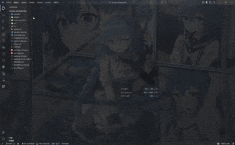
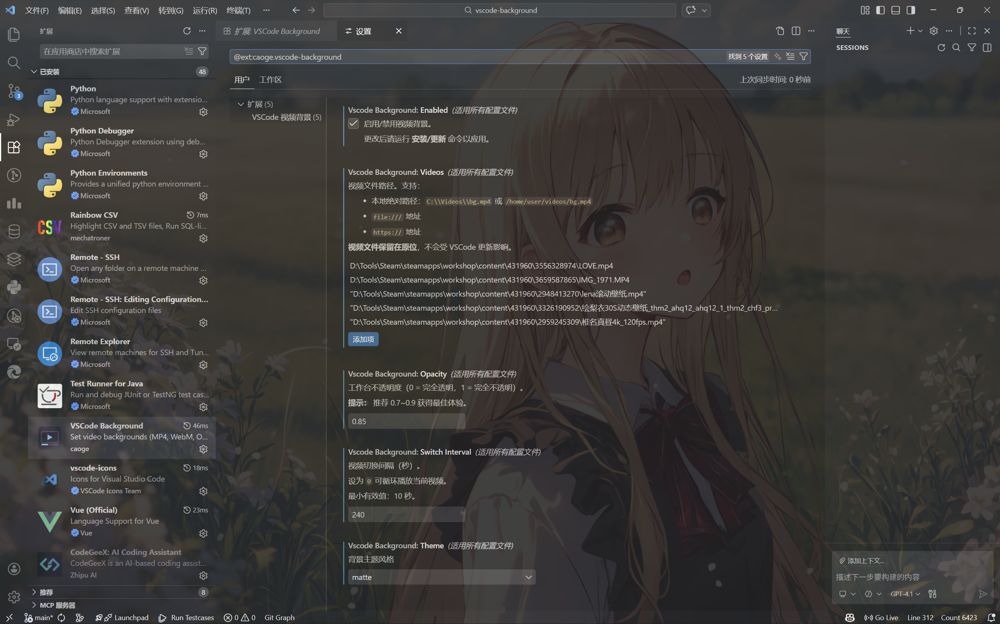
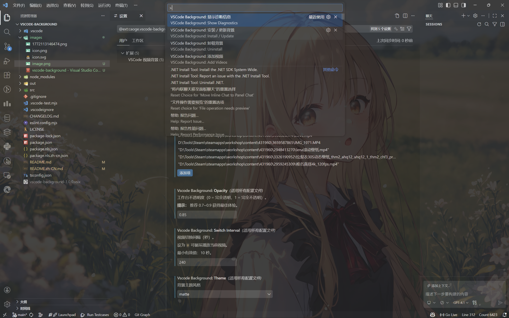

# VSCode Background - 视频背景插件

为您的 Visual Studio Code 工作区设置视频背景（MP4、WebM、OGG）的扩展 —— **不会在 VSCode 更新时被删除**。

[English](./README.md) | 简体中文

## 功能特性

- **视频背景支持**：支持 MP4、WebM 或 OGG 格式视频作为 VSCode 背景
- **多视频轮播**：加载多个视频，按可配置间隔自动轮换
- **设置直接编辑**：所有配置在 `settings.json` 中直接编辑，在 VSCode 更新间保存
- **视频持久保留**：视频文件路径存储在设置，文件保留在原始位置（不复制）
- **更新后自动恢复**：检测 VSCode 更新后的缺失补丁并提示重新应用
- **卸载自动清理**：`vscode:uninstall` 钩子在扩展卸载时自动移除补丁
- **无限循环模式**：将 `switchInterval` 设为 0 可让视频永久循环
- **多种主题**：Glass（玻璃 - 透明）和 Matte（磨砂 - 模糊毛玻璃）主题
- **自定义配置**：不透明度、切换间隔、主题选择等完全可自定义

## 效果示例

> 视频背景实际效果：


---
## v2.0.0 新特性

**重大架构重写**：
- ✅ **VSCode 更新时视频不再被删除**（v1 主要问题已解决）
- ✅ **单文件补丁方式**（仅修改 `workbench.desktop.main.js`）
- ✅ **视频路径存储在 settings.json**（无需复制到临时文件夹）
- ✅ **命令精简**（4 个命令 vs v1 的 16 个）
- ✅ **自动恢复**（更新后自动检测缺失补丁）
- ✅ **自动清理**（卸载钩子自动处理清理）
- ✅ **模块化代码**（6 个专注模块 vs 1935 行单文件）

参见 [CHANGELOG.md](./CHANGELOG.md) 查看完整升级细节和迁移指南。

## 安装配置

### 首次设置

1. **安装**扩展（从 VSCode 应用市场）
2. **打开设置** (`Ctrl+,`) → 搜索 `VSCode Background`
3. **检查设置**（初次应该为空）
4. **添加视频**：运行命令 `VSCode Background: Add Videos`
5. **应用设置**：运行命令 `VSCode Background: Install / Update`
6. **接受**管理员权限提示 (UAC)
7. **重启** VSCode

### 快速开始（Settings.json 方式）

1. **打开设置 UI** (`Ctrl+,`) → 搜索 "VSCode Background"
2. **找到设置项**（共 5 个）
3. **直接编辑**或使用命令设置值
4. **运行命令** `Install / Update` 应用更改
5. **重启** VSCode

## 使用方法

### 推荐：直接编辑 Settings.json


打开设置 (`Ctrl+,`) 并搜索 "VSCode Background"：

#### 设置界面示例


#### 命令行应用示例


```json
{
  "vscodeBackground.enabled": true,
  "vscodeBackground.videos": [
    "C:\\Videos\\background1.mp4",
    "C:\\Videos\\background2.mp4",
    "https://example.com/video.mp4"
  ],
  "vscodeBackground.opacity": 0.8,
  "vscodeBackground.switchInterval": 180,
  "vscodeBackground.theme": "glass"
}
```

然后运行：**`VSCode Background: Install / Update`** 命令

### 通过命令

按 `Ctrl+Shift+P` 打开命令面板：

- **`Install / Update`** - 应用 settings.json 中的当前设置（核心命令）
- **`Uninstall`** - 从 workbench 中移除背景（清理命令）
- **`Add Videos`** - 打开文件选择器添加视频路径到 settings.json
- **`Show Diagnostics`** - 显示调试信息

## 扩展设置

| 设置项                            | 类型    | 默认值  | 说明                             |
| --------------------------------- | ------- | ------- | -------------------------------- |
| `vscodeBackground.enabled`        | boolean | false   | 启用/禁用背景                    |
| `vscodeBackground.videos`         | array   | []      | **视频文件路径**（本地或 URL）   |
| `vscodeBackground.opacity`        | number  | 0.8     | 背景不透明度 (0-1)               |
| `vscodeBackground.switchInterval` | number  | 180     | 切换间隔（**秒**）(0 = 无限循环) |
| `vscodeBackground.theme`          | string  | "glass" | 主题："glass" 或 "matte"         |

### 视频路径格式

所有格式都支持，会自动转换：

```json
"vscodeBackground.videos": [
  "C:\\Users\\You\\Videos\\bg.mp4",          // Windows 绝对路径
  "/home/user/videos/bg.mp4",                // Linux/Mac 绝对路径
  "file:///C:/Videos/video.mp4",             // file:// URL
  "https://example.com/background.mp4",      // HTTPS URL
  "data:video/mp4;base64,..."                // Base64 编码视频
]
```

**重要**：视频文件**不会被复制到任何地方**。路径指向原始位置。文件在 VSCode 更新中保留。

## 命令列表

| 命令               | 用途                                                  |
| ------------------ | ----------------------------------------------------- |
| `Install / Update` | **核心** - 使用 settings.json 中的当前设置应用背景    |
| `Uninstall`        | **清理** - 完全从 VSCode 中移除背景                   |
| `Add Videos`       | **辅助** - 打开文件选择器添加视频路径到 settings.json |
| `Show Diagnostics` | **调试** - 显示扩展和系统信息                         |

## 为什么 v2.0.0 更好

### v1 的问题
- 视频存储在 VSCode 安装目录内的 `background-videos/` 文件夹
- 文件夹在每次 VSCode 更新时被删除（维护、小版本、大版本）
- 用户不得不反复添加视频
- 非常令人沮丧的用户体验 ❌

### v2 的解决方案
- 视频**路径**存储在 `settings.json` 中（在更新中保存）
- 实际文件保留在用户原始位置（不被 VSCode 触及）
- 补丁检测到缺失文件并提示用户重新应用
- 无文件复制，无文件夹管理 ✅

```
v1 流程：选择视频 → 复制到 background-videos/ → VSCode 更新 → 被删除 ❌
v2 流程：选择视频 → 路径存储到 settings.json → VSCode 更新 → 路径仍在 ✅
```

## 重要说明

### ⚠️ 卸载前

**只需运行卸载命令** - 清理钩子会自动处理：

1. 打开命令面板
2. 运行：`VSCode Background: Uninstall`
3. 然后卸载扩展

`vscode:uninstall` 钩子会自动从 `workbench.desktop.main.js` 中移除补丁。

### 从 v1 升级

v2 会自动：
- ✅ 读取旧的 v1 设置
- ✅ 将视频路径迁移到新格式
- ✅ 清理旧补丁文件
- ✅ 提示应用新背景

**无数据丢失！**

### "安装似乎损坏"警告

VSCode 显示此警告是因为我们修改了某些文件。完全无害 - 可以忽略或关闭。

扩展通过注入 CSS 来自动隐藏这个通知。

### 管理员权限

首次应用设置需要**管理员权限**：

✅ 正常且预期（修改 VSCode 核心系统文件）
✅ 在 UAC 提示上点击"是"
❌ 如果拒绝，背景将不会生效

脚本位置：扩展目录中的临时 PowerShell 脚本
范围：仅修改 VSCode 的 `workbench.desktop.main.js` 文件

### 文件被占用/拒绝访问错误弹窗


如上图所示，若出现“拒绝访问”或“Failed to create file handle”报错弹窗，这是因为 VSCode 进程未完全退出，导致部分文件被占用。

**此报错不会影响您的文件或系统安全，仅需完全关闭所有 VSCode 窗口后重试即可。**

- 解决方法：
  1. 关闭所有 VSCode 窗口
  2. 右键 VSCode → 以管理员身份运行
  3. 再次执行安装/卸载命令

## 支持的视频格式

- **MP4** (H.264/H.265)
- **WebM** (VP8/VP9)
- **OGG** (Theora)
- **HTTPS URLs**（流式播放，不下载）

## 系统要求

- VSCode 1.108.1 或更高版本
- Windows/Mac/Linux
- 管理员权限（仅首次设置）

## 故障排除

### 应用后背景不显示

1. 确保**重启 VSCode**（重载不够）
2. 运行 `Show Diagnostics` 验证路径
3. 检查视频文件是否仍在指定路径中存在

### "应用失败"错误

1. 关闭所有 VSCode 窗口
2. 以管理员身份运行 VSCode
3. 重试

### 设置未保存

1. 检查 `settings.json` 的文件权限
2. 确保对 VSCode 配置目录有写入权限
3. 重启 VSCode

### 视频无法播放

- 检查格式（支持 MP4/WebM/OGG）
- 尝试其他视频文件
- 验证文件路径正确
- 运行诊断：`Show Diagnostics` 命令

## 更新日志

### v2.0.0 - 2026-02-15

参见 [CHANGELOG.md](./CHANGELOG.md#200---2026-02-15) 了解完整详情。

**关键改进**：
- 视频现在在 VSCode 更新间保持
- 简化的设置模型（直接编辑 settings.json）
- 更新后自动恢复
- 卸载时自动清理
- 更好的错误消息
- 更清晰的单文件补丁方式

### 从 v1 迁移

设置会自动迁移。只需：
1. 打开设置
2. 验证 `vscodeBackground.videos` 包含您的视频（路径，不是复制）
3. 运行 `Install / Update`
4. 接受 UAC 提示
5. 重启

---

## 开发者指南

### 构建

```bash
npm install
npm run compile
```

### 监视模式

```bash
npm run watch
```

### 测试

```bash
npm run test
```

### 打包

```bash
vsce package
```

### 项目结构

```
src/
  ├── extension.ts          # 入口，命令注册
  ├── background.ts         # 核心逻辑（安装、卸载、诊断）
  ├── patchGenerator.ts     # 生成要注入的 JS 代码
  ├── patchFile.ts          # 补丁读写，版本检测
  ├── vscodePath.ts         # 路径工具，URL 转换
  ├── constants.ts          # 版本，标记，文件名
  ├── uninstall.ts          # 卸载钩子脚本
  └── test/
      └── extension.test.ts # 测试套件
```

**享受您的视频背景！**

## 未来规划

### 计划中的功能

- ✨ 图片背景支持（JPG、PNG、GIF）
- 🎨 更多主题样式（渐变、暗角等）
- 🎬 视频切换特效（淡入淡出、滑动、缩放）
- ⚙️ 每个工作区独立配置
- 🔊 音量控制和音频设置
- 🎯 基于时间的背景切换
- 📦 内置背景库
- 🌐 云同步能力

您的反馈助力我们持续改进！🚀
